\---

name: Flash Sale Architecture

overview: Спроектировать простую архитектуру Flash Sale (React + Express + Prisma/PostgreSQL + Socket.IO) с гарантиями против overselling, с истечением резервов, PENDING-платежами, идемпотентностью, email-outbox и стартом/завершением распродажи, а затем записать её в ARCHITECTURE.md. Код приложения на этом этапе не пишется.

todos:

&#x20; - id: write-architecture

&#x20;   content: Write ARCHITECTURE.md in the repo root with sections 1-10 below (English, with mermaid diagrams)

&#x20;   status: pending

isProject: false

\---


\# Архитектура Flash Sale (черновик ARCHITECTURE.md)


Репозиторий сейчас пуст (только `.git`). Единственный результат этого шага — файл \[ARCHITECTURE.md](ARCHITECTURE.md) в корне. Пишу его на английском, потому что это документ для проверяющих тестового задания. Ниже — его содержание.


\## Допущения (будут указаны в документе)


\- Одна активная распродажа, в ней один товар. Схема данных при этом допускает несколько распродаж.

\- Авторизация — заглушка: вход по имени пользователя, дальше клиент передаёт заголовок `X-User-Id`. Email генерируется как `{username}@example.test`. Дашборд не защищён.

\- Пользователь держит не больше одного активного резерва на распродажу, количество — 1 шт.

\- Цена хранится в центах (`Int`).

\- Один инстанс бэкенда. Для масштабирования позже подключается Redis-адаптер Socket.IO.

\- Отправка писем — мок (`mailer.send` пишет в лог и в массив в памяти, который проверяют тесты).


\## 1. Структура проекта


```

flash-sale/

&#x20; docker-compose.yml        # postgres, postgres-test, backend, frontend

&#x20; backend/

&#x20;   prisma/schema.prisma, migrations/, seed.ts

&#x20;   src/

&#x20;     app.ts                # express app (без listen, удобно для Supertest)

&#x20;     server.ts             # http + socket.io + запуск job

&#x20;     config.ts

&#x20;     db.ts                 # PrismaClient

&#x20;     errors.ts             # AppError + error middleware

&#x20;     realtime/socket.ts    # init, rooms, emit-хелперы

&#x20;     jobs/saleTicker.ts    # setInterval 1 c: start, end, expire, dispatch emails

&#x20;     modules/

&#x20;       users/        routes.ts, service.ts

&#x20;       sales/        routes.ts, service.ts

&#x20;       reservations/ routes.ts, service.ts

&#x20;       payments/     routes.ts, service.ts, mockProvider.ts

&#x20;       orders/       routes.ts, service.ts

&#x20;       emails/       outbox.ts, dispatcher.ts, mockMailer.ts

&#x20;       dashboard/    routes.ts, service.ts

&#x20;   tests/                  # Vitest + Supertest на реальной Postgres

&#x20; frontend/

&#x20;   src/

&#x20;     api/client.ts

&#x20;     socket.ts

&#x20;     hooks/ useSale.ts, useCountdown.ts, useSocketEvent.ts

&#x20;     pages/ Storefront, Cart, Orders, Dashboard

```


Слои простые: routes (HTTP, валидация через zod) → service (бизнес-логика и транзакции) → Prisma. Сокеты отправляют события только из сервисов и только после коммита транзакции.


```mermaid

flowchart LR

&#x20; ClientA\[BrowserA] -->|REST| Api\[ExpressRoutes]

&#x20; ClientB\[BrowserB] -->|REST| Api

&#x20; Api --> Services

&#x20; Ticker\["SaleTicker (1s)"] --> Services

&#x20; Services -->|"transaction + FOR UPDATE"| Db\[(PostgreSQL)]

&#x20; Services -->|"emit after commit"| Io\[SocketIO]

&#x20; Ticker -->|"claim + send"| Mailer\[MockMailer]

&#x20; Io --> ClientA

&#x20; Io --> ClientB

```


\## 2. Сущности и связи


\- \*\*User\*\*: `id`, `username` (unique), `email`, `role` (`CUSTOMER`/`ADMIN`).

\- \*\*Product\*\*: `id`, `name`, `description`, `imageUrl`.

\- \*\*Sale\*\*: `id`, `productId`, `priceCents`, `totalStock`, `availableStock`, `startsAt`, `endsAt`, `status` (`SCHEDULED`/`ACTIVE`/`ENDED`). Единственный источник правды об остатке.

\- \*\*Reservation\*\* (корзина): `id`, `userId`, `saleId`, `quantity`, `status` (`ACTIVE`/`PAYMENT\_PENDING`/`COMPLETED`/`EXPIRED`/`CANCELLED`), `expiresAt`, `createdAt`.

\- \*\*Order\*\*: `id`, `userId`, `saleId`, `reservationId` (\*\*unique\*\*), `amountCents`, `status` (`PENDING`/`PAID`/`FAILED`), `createdAt` (для сортировки заказов в кабинете и «последних заказов» на дашборде).

\- \*\*Payment\*\*: `id`, `orderId`, `idempotencyKey` (\*\*unique\*\*), `status` (`SUCCESS`/`FAILED`/`PENDING`), `createdAt`.

\- \*\*EmailOutbox\*\*: `id`, `type` (`ORDER\_PAID`/`SALE\_ENDED\_CART\_CLEARED`), `userId`, `toEmail`, `orderId?`, `reservationId?`, `payload` (Json), `status` (`PENDING`/`SENDING`/`SENT`/`FAILED`), `attempts`, `lastError?`, `createdAt`, `sentAt?`.

&#x20; - `UNIQUE(orderId, type)` — одно письмо о заказе на заказ.

&#x20; - `UNIQUE(reservationId, type)` — одно уведомление об очистке корзины на корзину. Второй ключ нужен потому, что у очищенной корзины нет заказа (`orderId = NULL`), а Postgres считает все NULL различными, так что `UNIQUE(orderId, type)` такие строки не дедуплицирует.


Связи: Product 1–N Sale; Sale 1–N Reservation; User 1–N Reservation, Order и EmailOutbox; Reservation 1–0..1 Order; Order 1–N Payment (повторные попытки после FAILED); Order 1–0..1 EmailOutbox(`ORDER\_PAID`); Reservation 1–0..1 EmailOutbox(`SALE\_ENDED\_CART\_CLEARED`).


Учёт остатка выражается одним инвариантом, который выполняется \*\*всегда, в том числе после завершения распродажи\*\*:

`availableStock + held + sold = totalStock`, где `held` — резервы `ACTIVE` и `PAYMENT\_PENDING`, `sold` — `COMPLETED`.

После `ENDED` поле `availableStock` означает «непроданный остаток»: число остаётся честным, но купить эти единицы нельзя, потому что статус `ENDED` запрещает резерв. Дашборд после окончания показывает это поле как Unsold. Инвариант проверяют тесты.


\## 3. База данных


\- Индексы: `Reservation(status, expiresAt)` для ticker, `Reservation(userId, saleId)`, `Order(userId)`, `Sale(status, startsAt)`, `Sale(status, endsAt)`, `EmailOutbox(status, createdAt)`.

\- Уникальные ограничения — последняя линия защиты: `Order.reservationId`, `Payment.idempotencyKey`, `EmailOutbox(orderId, type)`, `EmailOutbox(reservationId, type)`.

\- `CHECK (available\_stock >= 0 AND available\_stock <= total\_stock)` добавляется SQL-миграцией.

\- Имена таблиц совпадают с моделями Prisma (`"Sale"`, `"Reservation"`, …), колонки — snake\_case через `@map` (`available\_stock`), поэтому raw SQL пишется как `SELECT ... FROM "Sale" WHERE id = $1 FOR UPDATE`. Id — `Int` autoincrement.

\- Время берётся только на сервере (`now` в сервисах). Клиент получает `serverTime`, чтобы скорректировать таймеры.


\## 4. Резервирование, жизненный цикл распродажи и конкурентность


Правило одно: \*\*любое изменение остатка или статуса распродажи выполняется в `prisma.$transaction` после `SELECT ... FROM "Sale" WHERE id = $1 FOR UPDATE`\*\*. Это касается резерва, отмены, истечения, оплаты, старта и завершения распродажи. Все такие операции над одной распродажей выстраиваются в очередь на блокировке строки.


\*\*Условие продажи\*\* (проверяется и в reserve, и в checkout, не зависит от ticker):

`status != ENDED AND startsAt <= now < endsAt`.

Статус `ENDED` — явный запрет, проверка времени закрывает задержку ticker до 1 с.


Резерв (`reserve`):


1\. Блокируем строку Sale.

2\. Проверяем строго по порядку: распродажа не найдена → 404 `SALE\_NOT\_FOUND`; условие продажи → 409 `SALE\_NOT\_ACTIVE`; у пользователя уже есть резерв `ACTIVE`/`PAYMENT\_PENDING` → 409 `ALREADY\_RESERVED`; `availableStock < 1` → 409 `SOLD\_OUT`. `ALREADY\_RESERVED` идёт раньше `SOLD\_OUT`, чтобы пользователь, который сам держит последнюю единицу, получил точную ошибку, а не «закончилось».

3\. `availableStock -= 1`, создаём Reservation с `expiresAt = now + 10 min`.

4\. Коммит, затем `emit sale:stock`.


\*\*SaleTicker\*\* — один `setInterval` с периодом \*\*1 секунда\*\*. Флаг `running` пропускает тик, если предыдущий ещё не закончился. Каждый шаг — отдельная функция с параметром `now`, поэтому тесты вызывают шаги напрямую, без fake timers. Шаги по порядку:


1\. \*\*Старт распродажи.\*\* Распродажи с `status = SCHEDULED` и `startsAt <= now` переводятся под блокировкой в `ACTIVE`, затем `emit sale:status`.

2\. \*\*Завершение распродажи.\*\* Распродажи с `status != ENDED` и `endsAt <= now`, под блокировкой:

&#x20;  - все `ACTIVE`-резервы → `EXPIRED`, их единицы возвращаются в `availableStock` (инвариант сохраняется);

&#x20;  - для каждой очищенной корзины в той же транзакции вставляется `EmailOutbox(SALE\_ENDED\_CART\_CLEARED, reservationId)` с `ON CONFLICT DO NOTHING` (`createMany({ skipDuplicates: true })`);

&#x20;  - `status = ENDED`; `availableStock` \*\*не обнуляется\*\*;

&#x20;  - после коммита `emit sale:status`, `sale:stock`, `reservation:updated` владельцам.

3\. \*\*Истечение резервов.\*\* `ACTIVE` с `expiresAt <= now` → `EXPIRED`, товар возвращается, `emit sale:stock` и `reservation:updated`.

4\. \*\*Отправка писем\*\* (раздел 6).


\*\*`PAYMENT\_PENDING` никогда не истекает.\*\* Ни 10-минутный таймер, ни завершение распродажи его не трогают: ticker выбирает только `status = ACTIVE`. Выйти из `PAYMENT\_PENDING` можно одним способом — через resolve платежа: SUCCESS переводит в `COMPLETED`, FAILED — в `CANCELLED` с возвратом единицы в `availableStock`. Если распродажа уже `ENDED`, вернувшаяся единица остаётся непроданной. Платёж, который так и не разрешился, держит товар бессрочно. Это осознанное решение, такие платежи видны на дашборде (раздел «Вне рамок»).


Checkout дополнительно сам проверяет `expiresAt > now`, потому что ticker может запаздывать до 1 с.


\## 5. Как клиент узнаёт о старте распродажи


1\. `GET /api/sales/current` возвращает `status`, `startsAt`, `endsAt`, `availableStock`, `serverTime`. Клиент запоминает `offset = serverTime - Date.now()`.

2\. Пока `now + offset < startsAt`, витрина показывает обратный отсчёт «Starts in», кнопка неактивна.

3\. Когда ticker переводит распродажу в `ACTIVE`, сервер шлёт `sale:status { status: 'ACTIVE', ... }` в комнату `sale:{id}` и `dashboard`. Все подключённые клиенты одновременно включают кнопку и переключают таймер на `endsAt`.

4\. Запасной путь: когда локальный таймер доходит до нуля, клиент один раз перезапрашивает `GET /api/sales/current`. Это закрывает пропущенное событие или переподключение. При reconnect клиент тоже всегда перезапрашивает состояние.

5\. Сервер не доверяет кнопке: reserve проверяет условие продажи по своему времени. Ранний клик вернёт `409 SALE\_NOT\_ACTIVE`, а клик в первую секунду до тика пройдёт, потому что проверяется время, а не только статус.

6\. Если `startsAt`/`endsAt` меняются через дашборд, сервер тоже шлёт `sale:status`.


\## 6. Email outbox (ровно одно письмо)


\- Строка outbox вставляется \*\*в той же транзакции\*\*, что и изменение состояния:

&#x20; - `ORDER\_PAID` — когда Order становится `PAID` (checkout SUCCESS или resolve SUCCESS);

&#x20; - `SALE\_ENDED\_CART\_CLEARED` — для каждой `ACTIVE`-корзины, очищенной при завершении распродажи. Владельцы `PAYMENT\_PENDING` это письмо не получают: их резерв не очищается.

\- Вставка идёт с `ON CONFLICT DO NOTHING`, поэтому повторный checkout, повторный resolve или повторный тик второй строки не создадут — это гарантирует уникальный ключ.

\- Отправка (шаг 4 ticker): выбираем до 20 строк `PENDING`. Каждую строку «захватываем» атомарно: `UPDATE ... SET status = 'SENDING', attempts = attempts + 1 WHERE id = $1 AND status = 'PENDING'`. Отправляет только тот, у кого обновилась ровно одна строка. После отправки ставим `SENT` и `sentAt`. При ошибке возвращаем в `PENDING`, после 3 попыток — `FAILED`.

\- Письмо не уходит из HTTP-запроса или транзакции напрямую: если транзакция откатилась, письма не будет, а если упал mailer, состояние заказа не страдает.

\- Оговорка для документа: с реальным провайдером падение процесса между отправкой и `SENT` оставит строку в `SENDING`. Это at-least-once на уровне провайдера. Для мока и тестового задания этого достаточно; в реальной системе добавляется ключ идемпотентности провайдера (`outbox.id`).


\## 7. Идемпотентность платежа


\- Клиент генерирует `Idempotency-Key` (UUID) один раз на попытку оплаты и отправляет его в заголовке. Кнопка блокируется на время запроса.

\- `POST /api/reservations/:id/checkout` с телом `{ outcome: 'SUCCESS' | 'FAILED' | 'PENDING' }` (outcome задаётся для демо мок-провайдера). В одной транзакции под блокировкой Sale:

&#x20; 1. Если Payment с таким ключом уже есть — возвращаем сохранённый результат.

&#x20; 2. Если у резерва есть Order со статусом `PAID`/`PENDING` — возвращаем его. Второй ключ не может создать второй заказ.

&#x20; 3. Проверяем, что резерв `ACTIVE`, принадлежит пользователю, `expiresAt > now` и выполнено условие продажи.

&#x20; 4. Upsert Order по `reservationId`, создаём Payment, применяем результат:

&#x20;    - SUCCESS: Order `PAID`, Reservation `COMPLETED`, вставка `EmailOutbox(ORDER\_PAID)`;

&#x20;    - PENDING: Order `PENDING`, Reservation `PAYMENT\_PENDING` (с этого момента не истекает);

&#x20;    - FAILED: Order `FAILED`, Reservation остаётся `ACTIVE` до `expiresAt` (можно повторить с новым ключом).

\- Если ограничение уникальности всё-таки сработало (ошибка Prisma `P2002`), перечитываем запись и возвращаем существующий результат.

\- `POST /api/payments/:id/resolve` с телом `{ status }` — мок-вебхук провайдера для PENDING. Меняет только платежи в статусе `PENDING`, повторный вызов ничего не делает. SUCCESS: Order `PAID`, Reservation `COMPLETED`, `EmailOutbox(ORDER\_PAID)`. FAILED: Order `FAILED`, Reservation `CANCELLED`, `availableStock += 1`.

```mermaid

stateDiagram-v2

&#x20; \[\*] --> ACTIVE: reserve

&#x20; ACTIVE --> COMPLETED: pay SUCCESS

&#x20; ACTIVE --> PAYMENT\_PENDING: pay PENDING

&#x20; ACTIVE --> ACTIVE: pay FAILED

&#x20; ACTIVE --> EXPIRED: "10 min or sale end"

&#x20; ACTIVE --> CANCELLED: user cancel

&#x20; PAYMENT\_PENDING --> COMPLETED: resolve SUCCESS

&#x20; PAYMENT\_PENDING --> CANCELLED: resolve FAILED

```





У `PAYMENT\_PENDING` нет перехода в `EXPIRED`.

```mermaid

stateDiagram-v2

&#x20; \[\*] --> SCHEDULED

&#x20; SCHEDULED --> ACTIVE: "ticker, startsAt reached"

&#x20; ACTIVE --> ENDED: "ticker, endsAt reached"

&#x20; SCHEDULED --> ENDED: "endsAt passed before start tick"

```





\## 8. API


\- `POST /api/users/login` `{ username }` — найти или создать пользователя.

\- `GET /api/sales/current` — распродажа, товар, `status`, `startsAt`, `endsAt`, `availableStock`, `serverTime`.

\- `POST /api/sales/:id/reservations` — зарезервировать (409 при `SOLD\_OUT`, `SALE\_NOT\_ACTIVE`, `ALREADY\_RESERVED`).

\- `GET /api/reservations/me` — текущая корзина: `{ reservation, serverTime }`, где `reservation` — резерв `ACTIVE` или `PAYMENT\_PENDING` пользователя либо `null`.

\- `DELETE /api/reservations/:id` — отменить свой `ACTIVE`-резерв и вернуть товар (404 `RESERVATION\_NOT\_FOUND`, если резерва нет или он чужой; 409 `RESERVATION\_NOT\_ACTIVE` для любого другого статуса, включая `PAYMENT\_PENDING`).

\- `POST /api/reservations/:id/checkout` — оплата (требует `Idempotency-Key`).

\- `POST /api/payments/:id/resolve` — мок-вебхук.

\- `GET /api/orders/me` — заказы пользователя.

\- `GET /api/dashboard/sales/:id` — available/unsold, held, pending, sold, выручка, последние заказы, статистика outbox.

\- `POST /api/dashboard/sales` / `PUT /api/dashboard/sales/:id` — создать или настроить распродажу (цена, сток, время).

\- Единый формат ошибок: `{ error: { code, message } }`.


\## 9. WebSocket-события


Клиент → сервер: `sale:join { saleId }` (комната `sale:{id}`), `user:join { userId }` (комната `user:{id}`), `dashboard:join`.


Сервер → клиент:


\- `sale:stock { saleId, availableStock }` → `sale:{id}`, `dashboard`;

\- `sale:status { saleId, status, startsAt, endsAt, serverTime }` → `sale:{id}`, `dashboard` (старт, завершение, изменение времени);

\- `reservation:updated { reservationId, status }` → `user:{id}` (истекла или очищена при завершении);

\- `order:updated { orderId, status }` → `user:{id}`, `dashboard`.


События дополняют REST, а не заменяют его: при reconnect и при достижении нуля локальным таймером клиент перезапрашивает состояние.


\## 10. Ключевые автотесты (реальная Postgres из docker)


1\. Остаток 1, 20 параллельных `reserve` от разных пользователей → ровно 1 успех, 19 ответов 409, `availableStock = 0`.

2\. Тот же пользователь отправляет 2 параллельных `reserve` → создаётся 1 резерв.

3\. Истечение: `expireReservations(now + 10 min + 1 s)` → резерв `EXPIRED`, товар вернулся.

4\. \*\*PENDING никогда не истекает:\*\* после оплаты с PENDING вызываем `expireReservations(now + 1 h)` и `endSales(after endsAt)` → резерв остаётся `PAYMENT\_PENDING`, товар удержан. resolve SUCCESS → `PAID`; resolve FAILED → `CANCELLED`, товар вернулся.

5\. Идемпотентность: два параллельных checkout с одним ключом → 1 Order, 1 Payment, одинаковые ответы.

6\. Два параллельных checkout с \*\*разными\*\* ключами на один резерв → 1 оплаченный Order.

7\. Checkout по истёкшему резерву (ticker ещё не отработал) → 409.

8\. Завершение распродажи: `ACTIVE` → `EXPIRED`, `status = ENDED`, `availableStock` равен числу непроданных единиц (не 0), reserve → 409 `SALE\_NOT\_ACTIVE`, PENDING сохраняется.

9\. Старт: до `startsAt` reserve → 409; `startSales(startsAt)` → `ACTIVE` и `sale:status`; reserve в момент `startsAt` проходит даже до тика.

10\. \*\*Ровно одно письмо о заказе:\*\* параллельные checkout (один и тот же ключ и разные ключи), затем двойной resolve и два параллельных `dispatchEmails()` → одна строка `EmailOutbox(ORDER\_PAID)` в статусе `SENT`, `mockMailer.sent` содержит ровно одно письмо.

11\. \*\*Ровно одно письмо об очистке корзины:\*\* 2 корзины `ACTIVE` и 1 `PAYMENT\_PENDING`, два параллельных `endSales()` и два `dispatchEmails()` → ровно 2 письма `SALE\_ENDED\_CART\_CLEARED`, по одному на владельца корзины; владелец PENDING письма не получает.

12\. После каждого сценария, включая завершение, выполняется инвариант `available + held + sold = total`.

13\. (Опционально) Socket.IO: два клиента в комнате получают `sale:stock` после резерва и `sale:status` при старте.


\## 11. Гонки и защита от них


\- \*\*Последний товар покупают двое одновременно.\*\* Строка Sale блокируется `FOR UPDATE`, проверка и списание идут в одной транзакции, плюс `CHECK` в базе.

\- \*\*Двойной резерв одного пользователя.\*\* Проверка существующего резерва выполняется под той же блокировкой.

\- \*\*Истечение против оплаты в ту же секунду.\*\* Оба берут блокировку Sale. Checkout проверяет `expiresAt`, ticker меняет только `ACTIVE`. Кто первым взял блокировку, тот и выигрывает, второй видит уже новый статус.

\- \*\*Истечение или завершение против PENDING.\*\* Ticker выбирает только `ACTIVE`, поэтому `PAYMENT\_PENDING` трогать не может.

\- \*\*Двойной клик или повтор запроса.\*\* Уникальный `idempotencyKey` и уникальный `Order.reservationId`, обработка `P2002`.

\- \*\*Завершение распродажи против резерва или оплаты.\*\* Условие продажи проверяется в сервисе и не зависит от ticker. Ticker ставит `ENDED` под той же блокировкой.

\- \*\*Старт: клик раньше тика.\*\* Reserve проверяет `startsAt <= now` по серверному времени, а не только статус.

\- \*\*Наложение тиков.\*\* Флаг `running` плюс идемпотентные шаги: повторный `endSales` видит `ENDED` и ничего не делает.

\- \*\*Дубли писем.\*\* Уникальные ключи outbox и `ON CONFLICT DO NOTHING` при вставке; атомарный захват `PENDING → SENDING` при отправке.

\- \*\*Повторный resolve PENDING.\*\* Меняются только платежи в статусе `PENDING`.

\- \*\*Устаревшее состояние у второго клиента.\*\* Сокет-события отправляются после коммита, при reconnect данные заново берутся по REST, сервер — единственный источник правды: ошибка 409 обновляет UI.


\## Вне рамок (упомянуть в документе)


Настоящая авторизация, несколько товаров в корзине, горизонтальное масштабирование (Redis-адаптер, `SKIP LOCKED` в ticker и dispatcher), настоящий платёжный провайдер и таймаут для зависших PENDING, реальная отправка писем и восстановление строк, застрявших в `SENDING`.


